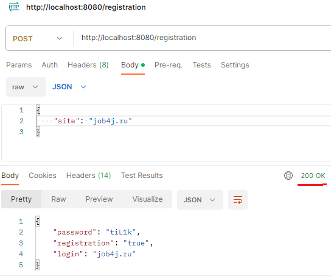
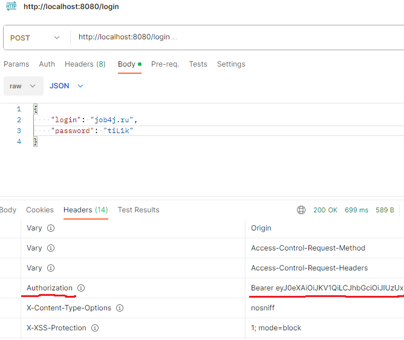
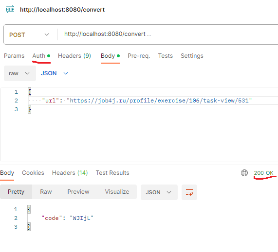
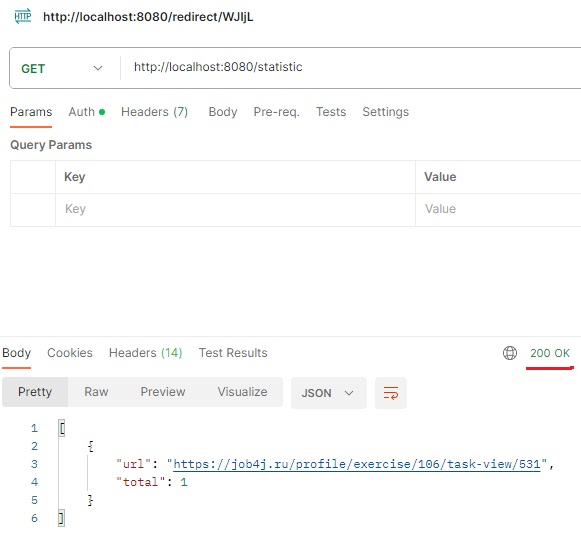

# job4j_url_shortcut
 - [О проекте](https://github.com/IvanPavlovets/job4j_url_shortcut/tree/master#%D0%BE-%D0%BF%D1%80%D0%BE%D0%B5%D0%BA%D1%82%D0%B5)
 - [Технологии](https://github.com/IvanPavlovets/job4j_url_shortcut/tree/master#%D1%82%D0%B5%D1%85%D0%BD%D0%BE%D0%BB%D0%BE%D0%B3%D0%B8%D0%B8) 
 - [Как использовать](https://github.com/IvanPavlovets/job4j_url_shortcut/tree/master#%D0%BA%D0%B0%D0%BA-%D0%B8%D1%81%D0%BF%D0%BE%D0%BB%D1%8C%D0%B7%D0%BE%D0%B2%D0%B0%D1%82%D1%8C)
   - [Регистрация сайта](https://github.com/IvanPavlovets/job4j_url_shortcut/tree/master#%D1%80%D0%B5%D0%B3%D0%B8%D1%81%D1%82%D1%80%D0%B0%D1%86%D0%B8%D1%8F-%D1%81%D0%B0%D0%B9%D1%82%D0%B0)
   - [Авторизация](https://github.com/IvanPavlovets/job4j_url_shortcut/tree/master#%D0%B0%D0%B2%D1%82%D0%BE%D1%80%D0%B8%D0%B7%D0%B0%D1%86%D0%B8%D1%8F)
   - [Регистрация URL](https://github.com/IvanPavlovets/job4j_url_shortcut/tree/master#%D1%80%D0%B5%D0%B3%D0%B8%D1%81%D1%82%D1%80%D0%B0%D1%86%D0%B8%D1%8F-url)
   - [Переадресация](https://github.com/IvanPavlovets/job4j_url_shortcut/tree/master#%D0%BF%D0%B5%D1%80%D0%B5%D0%B0%D0%B4%D1%80%D0%B5%D1%81%D0%B0%D1%86%D0%B8%D1%8F)
   - [Статистика](https://github.com/IvanPavlovets/job4j_url_shortcut/tree/master#%D1%81%D1%82%D0%B0%D1%82%D0%B8%D1%81%D1%82%D0%B8%D0%BA%D0%B0)
## О проекте
Чтобы обеспечить безопасность пользователей, все ссылки на сайте заменяются ссылками на наш сервис. 
Пользователь регистрирует свой сайт после чего получает логин (url сайта) и пароль (уникальный ключ). 

После авторизации пользователь получает токен, ключ доступа к регистрации ссылок (функционал сервиса), 
затем пользователь может осуществить регистрацию ссылок на своем сайте, зарегистрированном раннее. 

После регистрации ссылки (url) на сайте пользователь получает в ответ ключ в виде уникального кода 
ассоциированного с URL. Полуученый уникальный код можно использовать для получения 
ассоциированного адреса (url ссылки, регистрируемой ранее) и статус 302 (REDIRECT). 
Получения ассоциированного адреса (команда REDIRECT) можно выполнять без авторизации (без токена). 

Так же сервис регистрирует статистику, для каждого сайта, считается количество вызовов каждой ссылки (url). 
По определенному сайту можно получить количество обращений всех его ссылок. 

## Технологии
 * **Java 17**
 * **Spring Boot 2.7.14**
 * **Spring data jpa**
 * **Spring security**
 * Сборщик проектов - **Maven**
 * СУБД - **PostgreSQL**
 * Инструмент анализа стиля кода - **Checkstyle**
 * библиотека сокращения шаблонного кода в классах Java. - **Lombok**

## Как использовать
### Регистрация сайта.
Сервисом могут пользоваться разные сайты.  
Каждому сайту выдается пару пароль и логин.  

Чтобы зарегистрировать сайт в систему нужно отправить запрос:   
POST /registration  
C телом JSON объекта.  
>{  
>  "site": "job4j.ru"  
>}  

Ответ от сервера: 
>{  
>  "password": "УНИКАЛЬНЫЙ_КОД",  
>  "registration": "true/false",  
>  "login": "job4j.ru"  
>}  

Флаг registration указывает, что регистрация выполнена или нет, то есть сайт уже есть в системе.  

  
Рисунок 1. запрос на регистрацию и ответ со статусом 200 (выполнен удачно)  
### Авторизация.
Авторизацию реализованна через JWT.  
Пользователь отправляет POST запрос с login (url сайта) и password (уникальный ключ)  
и получает токен, ключ доступа к регистрации ссылок (функционал сервиса)  

Этот ключ направляеться в запросе в блоке HEAD.  

  
Рисунок 2. запрос на авторизацию пользователя и ответ  

Без авторизации доступны запросы:  
POST /registration 
GET /redirect/УНИКАЛЬНЫЙ_КОД_ССЫЛКИ.  
### Регистрация URL.
После регистрации сайта, на него можно отправлять ссылки и в ответ  
получать ассоциированный адрес (код ключ ссылки).  

Запрос выглядит так:  
POST /convert  
C телом JSON объекта.  
>{  
>  "url": "https://job4j.ru/profile/exercise/106/task-view/531"  
>}  

Ответ от сервера, c телом JSON объекта.  
>{  
>  "code": "WJIjL"  
>}  
>
   
Рисунок 3. запрос на регистрацию ссылки и ответ со статусом 200 (выполнен удачно)  
### Переадресация.
Когда сайт отправляет ссылку с кодом в ответ вернеться ассоциированный адрес и статус 302.  
Запрос выглядит так:  
GET /redirect/УНИКАЛЬНЫЙ_КОД  
Ответ от сервера в заголовке.  
HTTP CODE - 302 REDIRECT URL  

  
Рисунок 4. запрос на Переадресацию и ответ со статусом 302 (перенаправление).  
### Статистика.
В сервисе считается количество вызовов каждого адреса.  
По сайту можно получить статистку, считается количество вызовов каждой ссылки.  
Статистика выходит только по адресам которые пренадлежат авторизованному пользователю.  
Запрос выглядит так:  
GET /statistic  
Ответ от сервера, c телом JSON объекта.  
>{  
>  "url" : "https://job4j.ru/profile/exercise/106/task-view/531", total : 103}  
>}  

  
Рисунок 5. запрос/ответ статистика по ссылкам.  