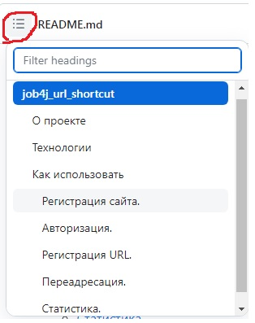
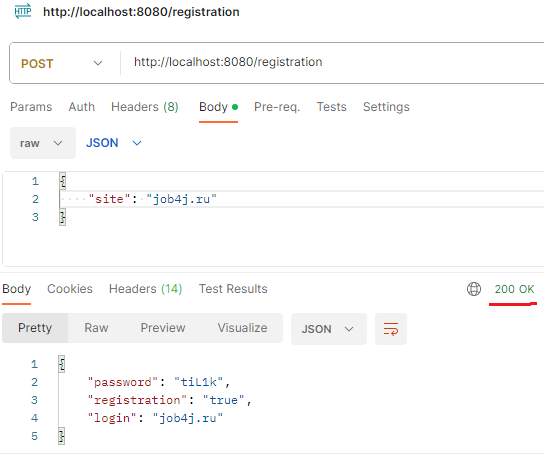
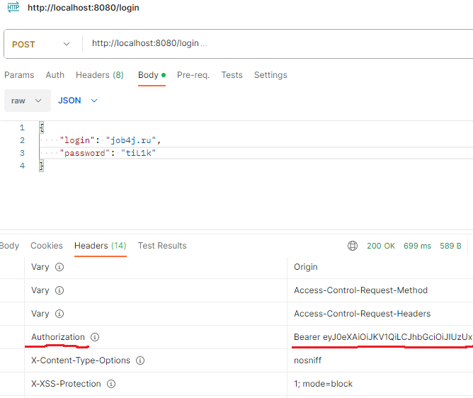
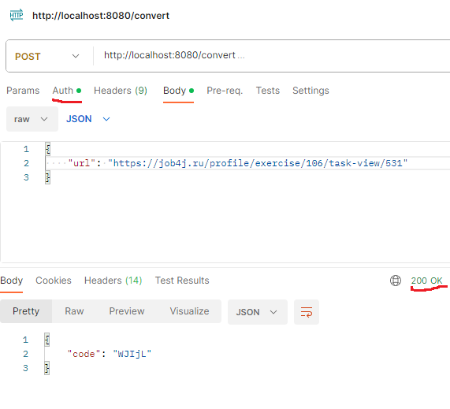
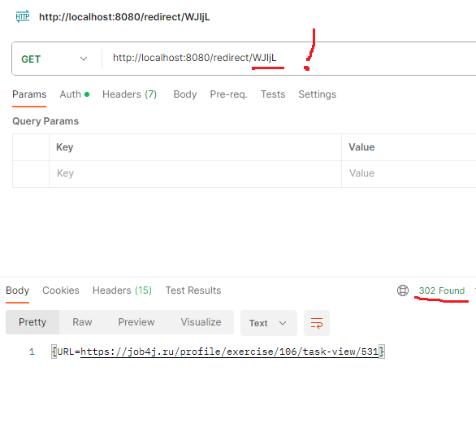
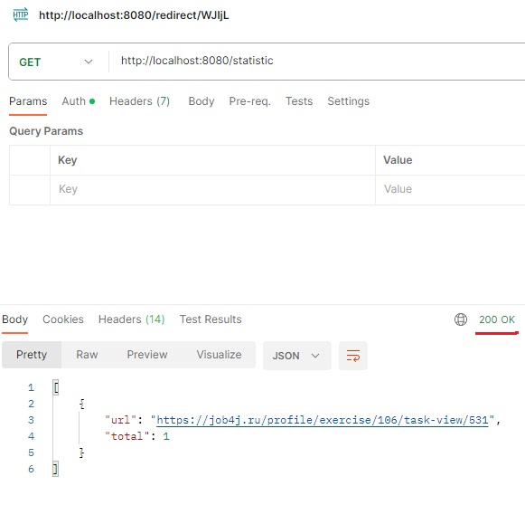
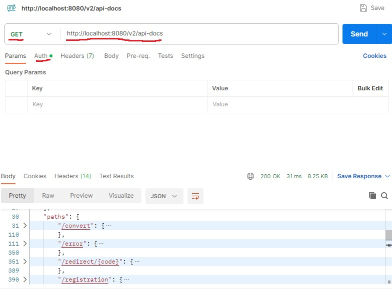
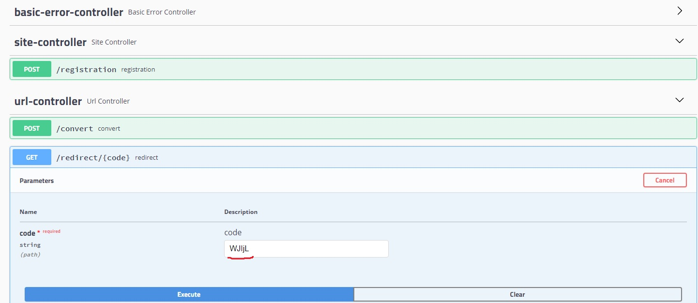
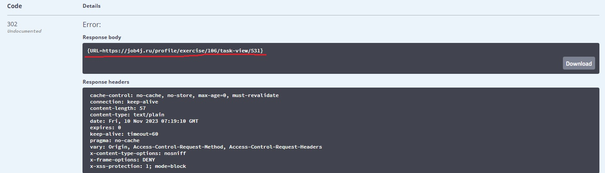
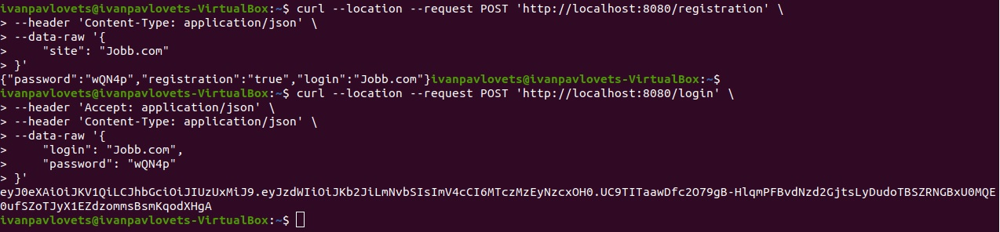

# job4j_url_shortcut
Переход, по разделам описания проекта, можно осуществить нажав на соответсвующую иконку с выпадающем списком.<br>

 <br>
Рисунок 1. Оглавление <br>
## О проекте
Чтобы обеспечить безопасность пользователей, все ссылки на сайте заменяются ссылками на наш сервис.<br>
Пользователь регистрирует свой сайт после чего получает логин (url сайта) и пароль (уникальный ключ).<br>

После авторизации пользователь получает токен, ключ доступа к регистрации ссылок (функционал сервиса),<br>
затем пользователь может осуществить регистрацию ссылок на своем сайте, зарегистрированном раннее.<br>

После регистрации ссылки (url) на сайте пользователь получает в ответ ключ в виде уникального кода<br>
ассоциированного с URL. Полуученый уникальный код можно использовать для получения<br>
ассоциированного адреса (url ссылки, регистрируемой ранее) и статус 302 (REDIRECT).<br>
Получения ассоциированного адреса (команда REDIRECT) можно выполнять без авторизации (без токена).<br>

Так же сервис регистрирует статистику, для каждого сайта, считается количество вызовов каждой ссылки (url).<br>
По определенному сайту можно получить количество обращений всех его ссылок.<br>


## Технологии
 * **Java 17**
 * **Spring Boot 2.7.14**
 * **Spring data jpa**
 * **Spring security**
 * Сборщик проектов - **Maven**
 * СУБД - **PostgreSQL**
 * Инструмент анализа стиля кода - **Checkstyle**
 * библиотека сокращения шаблонного кода в классах Java. - **Lombok**

## Как использовать
### Регистрация сайта.
Сервисом могут пользоваться разные сайты. <br>
Каждому сайту выдается пару пароль и логин. <br>

Чтобы зарегистрировать сайт в систему нужно отправить <br>
POST запрос на адресс: <br>
```
http://localhost:8080/registration
```
C телом JSON объекта. <br>
```
{ 
  "site": "job4j.ru"
}
```
Ответ от сервера:
```
{ 
  "password": "УНИКАЛЬНЫЙ_КОД", 
  "registration": "true/false",
  "login": "job4j.ru"
} 
```
Флаг registration указывает, что регистрация выполнена или нет, то есть сайт уже есть в системе. <br>

 <br>
Рисунок 2. запрос на регистрацию и ответ со статусом 200 (выполнен удачно) <br>
### Авторизация.
Авторизацию реализованна через JWT. Пользователь отправляет <br>
POST запрос на адресс: <br>
```
http://localhost:8080/login
```
с login (url сайта) и password (уникальный ключ): <br>
```
{ 
    "login": "job4j.ru",
    "password": "tiL1k"
} 
```
и получает токен, ключ доступа к регистрации ссылок (функционал сервиса), <br>
токен приходит с ответом 200, в Headers -> Authorization -> Bearer ...

В дальнейшем, этот ключ направляеться в запросе в блоке HEAD. <br>

 <br>
Рисунок 3. запрос на авторизацию пользователя и ответ <br>

Без авторизации доступны запросы: <br>
POST /registration<br>
GET /redirect/УНИКАЛЬНЫЙ_КОД_ССЫЛКИ. <br>
### Регистрация URL.
После регистрации сайта, на него можно отправлять ссылки <br>
и в ответ получать ассоциированный адрес (код ключ ссылки). <br>

POST Запрос выглядит так: <br>
```
http://localhost:8080/convert
```
C телом JSON объекта: 
```
{
  "url": "https://job4j.ru/profile/exercise/106/task-view/531"
}
```
Ответ от сервера, c телом JSON объекта: 
```
{ 
  "code": "WJIjL"
} 
```
 <br> 
Рисунок 4. запрос на регистрацию ссылки и ответ со статусом 200 (выполнен удачно) <br>
### Переадресация.
Когда сайт отправляет ссылку с кодом в ответ вернеться ассоциированный адрес и статус 302. <br>
Запрос выглядит так: <br>
GET /redirect/УНИКАЛЬНЫЙ_КОД <br>
```
http://localhost:8080/redirect/WJIjL
```
Ответ от сервера в заголовке: <br>
HTTP CODE - 302 REDIRECT URL <br>
```
{URL=https://job4j.ru/profile/exercise/106/task-view/531}
```

 <br>
Рисунок 5. запрос на Переадресацию и ответ со статусом 302 (перенаправление). <br>
### Статистика.
В сервисе считается количество вызовов каждого адреса. <br>
По сайту можно получить статистку, считается количество вызовов каждой ссылки. <br>
Статистика выходит только по адресам которые пренадлежат авторизованному пользователю. <br>
Запрос выглядит так: <br>
GET /statistic <br>
```
http://localhost:8080/statistic
```
Ответ от сервера, c телом JSON объекта:
```
{
  "url" : "https://job4j.ru/profile/exercise/106/task-view/531", total : 103}
}
```

 <br>
Рисунок 6. запрос/ответ статистика по ссылкам. <br>
### Документация swagger.
В этом разделе содержится инструкция для доступа к описанию RESTful API спецификаций проекта, <br> 
В формате JSON и HTML.<br>
Доступ к JSON спецификации можно получить, посредством программы POSTMAN, <br>
обратившись с GET запросом по адресу: <br>
http://localhost:8080/v2/api-docs <br>
ПРЕДВАРИТЕЛЬНО необходимо получить token через процедуру авторизации,
выполнив POST запрос по адресу http://localhost:8080/login <br>
Полученный токкен необходимо вставить во вкладку Auth <br>
Описание JSON документации: <br>
> раздел "tag" - содержит описание контролеров проекта <br>
> раздел "path" - описание взаимодействия всех URL-path проекта <br>
> раздел "parameters" - описание всего того что мы можем поместить в тело JSON обьекта <br>
> парметр "schema" скажет какой должна быть схема тела ващего сообщения <br>
> раздел "/error" - возможные ответы с кодами ошибок на ваше сообщение. <br>
> раздел "definitions" - это схема обьектов модели проекта. Разверните поля этих обьектов, <br>
> что бы посмотреть что необходимо отправить, что бы сделать вызовы  <br>

 <br>
Рисунок 7. Вызов JSON документации в программе POSTMAN. <br>

Документация в формате HTML можно получить в браузере по адресу:
http://localhost:8080/swagger-ui.html

По данному адресу будут представлены API:
 - базовый контроллер ошибок
 - контроллеры приложения (Site Controller, Url Controller)

Контролеры приложения можно развернуть и увидеть все конечные точки API.
Также можно сделать пробный вызов API, подерживаеться движком swagger.
На рисунке 8 представлен пробный вызов API, не требующего авторизации 

 <br>
Рисунок 8. Вызов HTML документации с помощью swagger. <br>

 <br>
Рисунок 9. Успешный ответ, на вызов ссылки с кодом ресурса /redirect/WJIjL в swagger. <br>

С помощью swagger можно делать вызовы API в своей документации.

### Образы Docker.

что бы запустить приложение необходима программа Docker Compose

Проверяем наличие программы и, если её нет, устанавливаем.

[Установка Docker Compose](https://github.com/IvanPavlovets/job4j_url_shortcut/blob/master/01_installation/INSTALLATION.md)

_Примечание: Все команды выполняем в терминале Linux_<br>
<br>
Склонируйте проект:
```
git clone https://github.com/IvanPavlovets/job4j_url_shortcut.git
```
Перейдите в папку проекта:
```
cd job4j_url_shortcut
```
Выполните команду создание образов проекта:
```
docker-compose build
```
или запустите все образы проекта (предварительно, выполниться команда создания):
```
docker-compose up -d
```
выйти из каталога проекта
```
cd ..
```
Регистрация сайта: 
```
curl --location --request POST 'http://localhost:8080/registration' \
--header 'Content-Type: application/json' \
--data-raw '{
    "site": "Jobb.com"
}'
```
Получение токена:

```
curl --location --request POST 'http://localhost:8080/login' \
--header 'Accept: application/json' \
--header 'Content-Type: application/json' \
--data-raw '{
    "login": "your_login",
    "password": "your_password"
}'
```

 <br>
Рисунок 10. Демонстрация работы проекта, отправка запросов (Регистрация сайта, Получение токена) через curl, в терминале linux. <br>